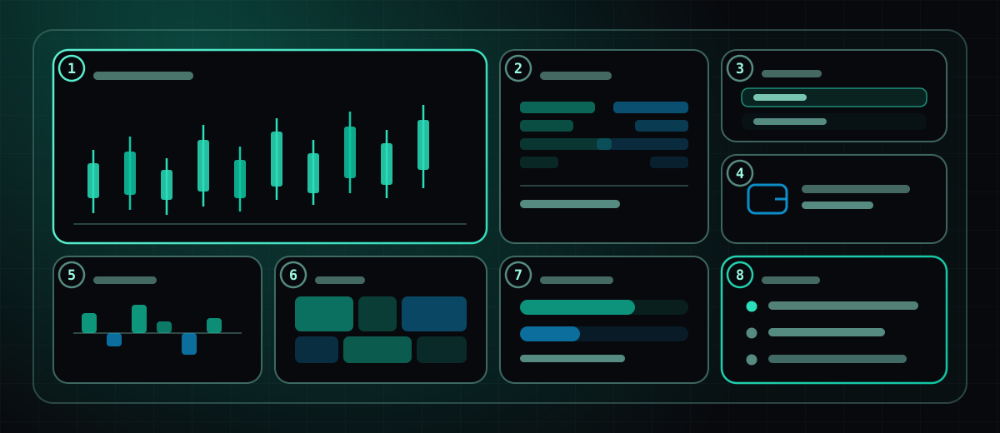
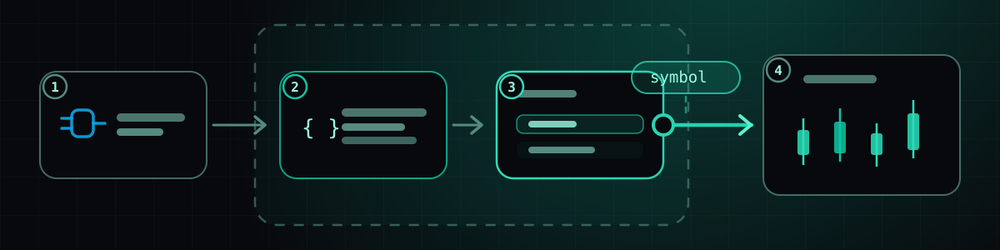
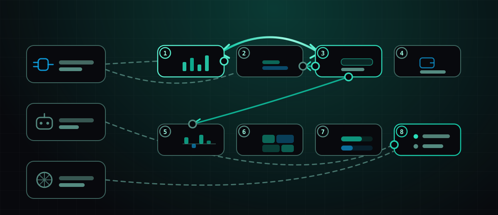

Het meeste wat we hier schrijven is een release note: iets is uitgebracht, dit is
wat het doet. Dit bericht is van een ander soort. Niets hieronder is nieuw. Het is
één af scherm, uit elkaar gehaald, zodat je ziet hoe de onderdelen die we apart
uitbrengen echt samenkomen.

De desk is een crypto-cockpit — acht widgets op één scherm, gebouwd uit publieke
marktdata, nergens keys. Niets is speciaal. Dat is het punt: elk deel kun je
herbouwen door het te beschrijven.

## Het scherm

1. **Candlesticks.** De anker-tegel. Eén symbool, één interval, een live laatste
   candle. Al het andere op het scherm voedt of volgt deze.
2. **Orderbook-diepte.** Bids en asks als gestapelde balken, zodat een dun boek
   zichtbaar is in plaats van afgeleid.
3. **Watchlist.** Een handvol symbolen, één geselecteerd. Deze tegel is het
   stuurwiel van het scherm — meer daarover hieronder.
4. **Wallet-saldi.** Een publiek adres, read-only, via een wallet-verbinding. Geen
   signing, geen keys, niets om goed te keuren.
5. **Funding rates.** Perp-funding over de laatste vensters, positief en negatief
   aan weerszijden van een nulijn.
6. **Heatmap.** Hetzelfde universum als de watchlist, met grootte en schaduw, om
   te scannen in plaats van te lezen.
7. **Prediction markets.** Wat de menigte prijst, naast wat het orderbook prijst.
   Het interessante is wanneer de twee het oneens zijn.
8. **Alert-inbox.** Meestal leeg. Gevuld door een bot die blijft werken met het
   tabblad dicht.

Een **scherm** is één widget-indeling. Een **workspace** houdt er meerdere. Het
canvas is vrij — je plaatst dingen waar je wilt, en groepen kunnen tegels stapelen
in mozaïeken of tabbladen — maar het is een canvas met randen, geen oneindig
vlak waarin je verdwaalt.

## Eén tegel helemaal uitwerken

Elke tegel op dat scherm heeft dezelfde vier lagen eronder. Neem de watchlist:

1. **Een verbinding.** Eén van de 90 live connectors — hier publieke marktdata,
   die helemaal geen credentials nodig heeft. Verbindingen zijn inventaris, geen
   configuratie: je koppelt er één aan een widget en de widget wordt herbouwd
   wetende hoe hij die moet gebruiken.
2. **Gegenereerde code.** Je beschreef een watchlist; een build schreef er één.
   Die heeft versiegeschiedenis, en je kunt elke beurt van het gesprek lezen dat
   hem produceerde.
3. **De draaiende widget.** Die draait sandboxed. Een widget dat misgaat, ruïneert
   zijn eigen tegel en niets anders op het scherm — de enige reden waarom het
   redelijk is software te draaien die je niet hebt gelezen.
4. **Een uitgaande draad.** De tegel emitteert wanneer je op een rij klikt. Op
   zichzelf gaat dat nergens heen. Wat het een cockpit maakt in plaats van acht
   losse tegels is het volgende deel.

## Draden houden het bij elkaar, niet code

Twee mechanismen zitten achter het ene woord *draad*, en het onderscheid zie je in
het diagram als vol versus gestippeld:

- **Widget naar widget** is een **glue link** — echte gegenereerde code, met
  eigen versiegeschiedenis, draaiend in een eigen verborgen runtime, die map wat
  de ene tegel emitteert naar wat de andere verwacht. De boog tussen watchlist en
  chart is tweerichtings: wijzig het symbool in een van beide en beide volgen.
  Tweerichtingsdraden zouden voor altijd echoën zonder hulp, dus een afgeleverde
  waarde wordt onthouden en de identieke terugkaats wordt één keer weggegooid.
- **Widget naar verbinding, bot of agent** is een **attachment** — een record van
  wat een rebuild de *eigen* code van die widget leerde te doen. Dat zijn de
  stippellijnen. Gefaseerd in plaats van automatisch, zodat vijf bronnen achter
  elkaar browsen één rebuild kost in plaats van vijf.

Op dit scherm is de bedrading bewust dun: de watchlist stuurt de chart beide
kanten op, en het orderbook en de funding-tegel één kant. Drie draden. Een vierde
voor de heatmap was verleidelijk en fout — een tegel die verandert wanneer je niet
keek is een tegel die je niet meer vertrouwt.

De draad-editor heeft een **Testen**-balk precies hiervoor. Kies een topic en een
waarde, kies welk uiteinde doet alsof het emitteert, en stuur een echt event door
de echte runtime. Het verdict onderscheidt *deze draad draait niet* van *hij
draaide maar stuurde niets door voor dat topic* van *doorgestuurd, maar die
widget staat niet op het scherm om het te ontvangen*. Voordat dat bestond leken
een kapotte draad en een draad naar een ander scherm identiek: er gebeurde niets.

## Wat blijft draaien met tab dicht

Tegel 8 is de enige die niet echt een widget is in de gebruikelijke zin. Het is
een inbox, en wat die vult is een **bot**.

Bots zijn bewust onglamoureus — een vast catalogus van processors (drempel,
verandering, crossover, RSI, volumepiek, digest, nieuwe trade, walletactiviteit,
walletsaldo) over precies drie soorten dingen: marktcandles, een brokeraccount,
een publiek walletadres. Geen model in de loop, en dat is precies waarom je er
één een maand kunt laten draaien. Wanneer er één afgaat, verspreidt hij naar
vier plekken tegelijk: de alert-inbox, de widgetbus (zodat tegel 8 live
bijwerkt), een webhook en een gekoppelde database.

**Agents** zijn de andere helft, en de tegenovergestelde vorm: algemeen, met
grants per tool voor websearch, social, marktdata, databases, geheugen en meer,
op een handmatige of 15-minuten-tot-dagelijks trigger. Een agent pak je wanneer
de vraag is *«vat samen wat er vannacht gebeurde»* in plaats van *«zeg me wanneer
dit dat kruist.»* Beide voeden tegel 8; slechts één is goedkoop om onbeheerd te
laten.

## Wat dit scherm bewust niet doet

Het handelt niet. Niets hier plaatst een order — dat is een aparte grant, op een
aparte connector, en dat op hetzelfde scherm zetten als een heatmap waar je naar
kijkt is hoe ongelukken gebeuren.

Het houdt geen key. Elke bron is publiek: candles, diepte, funding, prediction
markets, een read-only adres. Een desk die je aan iemand anders kunt geven zonder
achteraf iets in te trekken is meer waard dan een desk met twee extra tegels.

En het is niet af, want dat is geen staat die een scherm bereikt. De eerlijke
versie van deze teardown is dat de layout hierboven de vierde is; de eerste drie
hadden meer tegels en vertelden minder.

[Start Nexow](https://x.nexow.ai) en beschrijf de eerste tegel. De andere zeven
zijn makkelijker.
