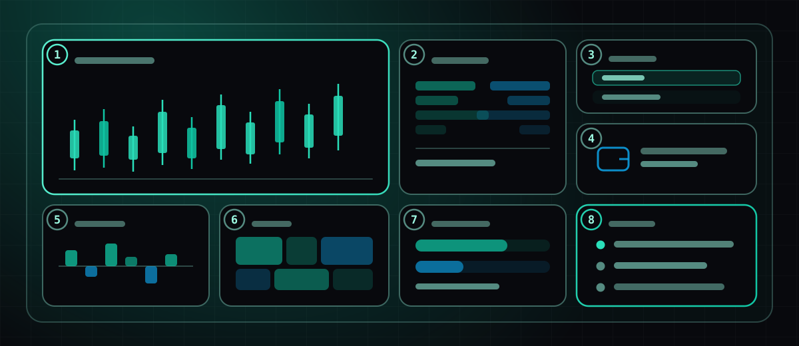
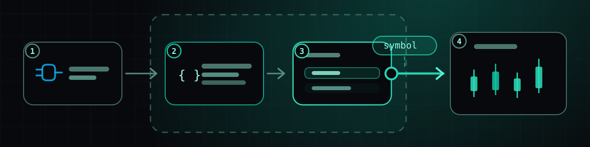
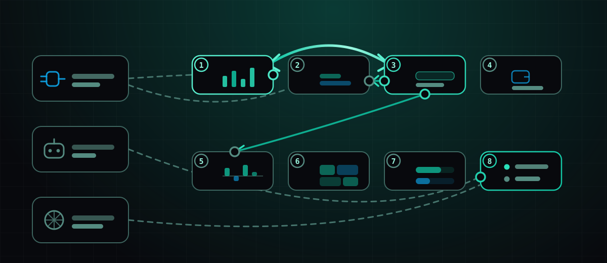

Większość tego, co tu piszemy, to notki o wydaniach: coś trafiło do produktu, oto
co robi. Ten wpis jest inny. Nic poniżej nie jest nowe. To jeden gotowy ekran,
rozebrany na części, żebyś zobaczył, jak elementy, które wydajemy osobno,
faktycznie ze sobą współgrają.

Stanowisko to kokpit kryptowalutowy — osiem widgetów na jednym ekranie,
zbudowanych z publicznych danych rynkowych, bez żadnych kluczy. Nie ma w nim nic
wyjątkowego. I o to właśnie chodzi: każdy element możesz odtworzyć, po prostu go
opisując.

## Ekran

1. **Świece.** Kafelek-kotwica. Jeden symbol, jeden interwał, ostatnia świeca na
   żywo. Wszystko inne na ekranie albo go zasila, albo za nim podąża.
2. **Głębokość arkusza zleceń.** Oferty kupna i sprzedaży jako skumulowane
   słupki, więc płytki arkusz widać, zamiast się go domyślać.
3. **Lista obserwowanych.** Kilka symboli, jeden z nich zaznaczony. Ten kafelek
   to kierownica ekranu — więcej o tym poniżej.
4. **Salda portfela.** Publiczny adres, tylko do odczytu, przez połączenie z
   portfelem. Bez podpisywania, bez kluczy, nic do zatwierdzania.
5. **Funding rates.** Funding kontraktów perpetual z kilku ostatnich okien,
   dodatni i ujemny po obu stronach linii zera.
6. **Mapa cieplna.** Ten sam zestaw co lista obserwowanych, skalowany i
   cieniowany — do rzucenia okiem, a nie do czytania.
7. **Rynki predykcyjne.** Co wycenia tłum, obok tego, co wycenia arkusz zleceń.
   Najciekawsze jest to, gdy się ze sobą nie zgadzają.
8. **Skrzynka alertów.** Przez większość dnia pusta. Wypełnia ją bot, który
   pracuje dalej przy zamkniętej karcie.

**Ekran** to jeden układ widgetów. **Workspace** mieści ich kilka. Canvas jest
swobodny — umieszczasz rzeczy tam, gdzie chcesz, a grupy mogą układać kafelki w
mozaiki lub karty — ale to canvas z krawędziami, a nie nieskończona płaszczyzna,
w której można się zgubić.

## Prześledź jeden kafelek do samego dołu

Pod każdym kafelkiem na tym ekranie leżą te same cztery warstwy. Weźmy listę
obserwowanych:

1. **Połączenie.** Jeden z 90 aktywnych konektorów — tutaj publiczne dane
   rynkowe, które w ogóle nie wymagają poświadczeń. Połączenia to inwentarz, a
   nie konfiguracja: podpinasz jedno do widgetu, a widget zostaje przebudowany
   tak, by wiedział, jak z niego korzystać.
2. **Wygenerowany kod.** Opisałeś listę obserwowanych; build ją napisał. Ma
   historię wersji i możesz przeczytać każdą turę rozmowy, która ją stworzyła.
3. **Działający widget.** Wykonuje się w sandboxie. Widget, który źle działa,
   psuje tylko własny kafelek i nic więcej na ekranie — i to jedyny powód, dla
   którego rozsądnie jest uruchamiać oprogramowanie, którego nie czytałeś.
4. **Przewód na zewnątrz.** Kafelek emituje zdarzenie, gdy klikniesz wiersz. Sam
   w sobie nigdzie to nie prowadzi. To, co czyni z tego kokpit, a nie osiem
   oddzielnych kafelków, to kolejna część.

## Całość spajają przewody, nie kod

Za jednym słowem *przewód* kryją się dwa mechanizmy, a różnica widoczna jest na
diagramie jako linia ciągła kontra przerywana:

- **Widget z widgetem** to **glue link** — prawdziwy wygenerowany kod, z własną
  historią wersji, działający we własnym ukrytym środowisku uruchomieniowym,
  mapujący to, co emituje jeden kafelek, na to, czego oczekuje drugi. Łuk między
  listą obserwowanych a wykresem jest dwukierunkowy: zmień symbol w którymkolwiek
  z nich, a oba podążą za zmianą. Dwukierunkowe przewody odbijałyby echo w
  nieskończoność, dlatego dostarczona wartość jest zapamiętywana, a identyczne
  odbicie zostaje jednorazowo odrzucone.
- **Widget z połączeniem, botem lub agentem** to **podpięcie** — zapis tego,
  czego przebudowa nauczyła *własny* kod widgetu. To są linie przerywane.
  Etapowane, a nie automatyczne, więc przejrzenie pięciu źródeł pod rząd kosztuje
  jedną przebudowę zamiast pięciu.

Na tym ekranie okablowanie jest celowo skromne: lista obserwowanych steruje
wykresem w obie strony, a arkuszem zleceń i kafelkiem funding w jedną. Trzy
przewody. Dodanie czwartego do mapy cieplnej było kuszące i błędne — kafelek,
który zmienia się, gdy na niego nie patrzysz, to kafelek, któremu przestajesz
ufać.

Edytor przewodów ma właśnie do tego pasek **Przetestuj**. Wybierz temat i
wartość, wskaż, który koniec udaje emisję, i wyślij prawdziwe zdarzenie przez
prawdziwe środowisko uruchomieniowe. Werdykt odróżnia *ten przewód nie działa* od
*zadziałał, ale nic nie przekazał dla tego tematu* oraz od *przekazał, ale tego
widgetu nie ma na ekranie, by odebrał*. Zanim to powstało, zepsuty przewód i
przewód wskazujący na inny ekran wyglądały identycznie: nic się nie działo.

## Co działa dalej po zamknięciu karty

Kafelek 8 jako jedyny nie jest widgetem w zwykłym sensie. To skrzynka odbiorcza,
a wypełnia ją **bot**.

Boty są celowo mało efektowne — stały katalog procesorów (próg, zmiana,
przecięcie, RSI, skok wolumenu, podsumowanie, nowa transakcja, aktywność
portfela, saldo portfela) działających na dokładnie trzech rodzajach danych:
świecach rynkowych, rachunku maklerskim i publicznym adresie portfela. W pętli nie
ma modelu i właśnie dlatego możesz zostawić bota działającego na miesiąc. Gdy się
uruchomi, rozsyła sygnał jednocześnie w cztery miejsca: do skrzynki alertów, na
magistralę widgetów (więc kafelek 8 aktualizuje się na żywo), do webhooka i do
podłączonej bazy danych.

**Agenci** to druga połowa i zupełnie inny kształt: ogólnego przeznaczenia, z
uprawnieniami per narzędzie do wyszukiwania w sieci, mediów społecznościowych,
danych rynkowych, baz danych, pamięci i nie tylko, uruchamiani ręcznie lub
triggerem od 15 minut do raz dziennie. Po agenta sięgasz, gdy pytanie brzmi
*„podsumuj, co wydarzyło się w nocy”*, a nie *„daj znać, gdy to przetnie tamto”*.
Oba zasilają kafelek 8; tylko jeden z nich tanio zostawić bez nadzoru.

## Czego ten ekran celowo nie robi

Nie handluje. Nic tutaj nie składa zleceń — to osobne uprawnienie, na osobnym
konektorze, a umieszczenie go na tym samym ekranie co mapa cieplna, na którą
tylko zerkasz, to prosta droga do wypadku.

Nie przechowuje klucza. Każde źródło jest publiczne: świece, głębokość, funding,
rynki predykcyjne, adres tylko do odczytu. Stanowisko, które możesz przekazać
komuś innemu bez unieważniania czegokolwiek później, jest warte więcej niż
stanowisko z dwoma dodatkowymi kafelkami.

I nie jest skończone, bo ekran nigdy nie osiąga takiego stanu. Szczera wersja tej
analizy jest taka, że powyższy układ jest czwarty; trzy pierwsze miały więcej
kafelków i mówiły mniej.

[Uruchom Nexow](https://x.nexow.ai) i opisz pierwszy kafelek. Pozostałe siedem
pójdzie łatwiej.
